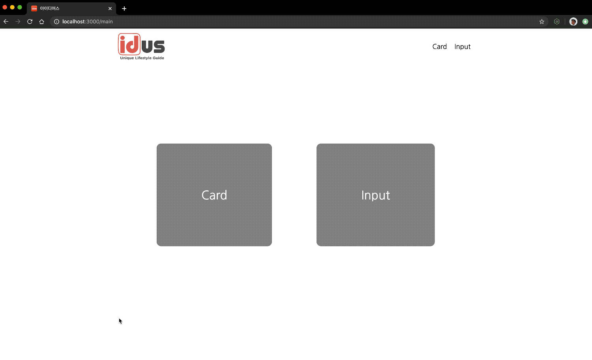

> ## Contents

- [Introduction](#Introduction)

- [Installation](#Installation)

- [Features](#Features)

- [Approach](#Approach)

- [Project Structure](#Project-Structure)

- [Learning points](#Learning-points)

> ### Introduction

- 카드 UI와 입력 폼 UI를 볼 수 있는 SPA구성의 웹 어플리케이션.

  

> ### Installation

```
$git clone https://github.com/MrKamake/idus.git

$cd idus

$yarn install

$yarn start
```

> ### Features

1. 카드 UI
   - 파트의 유무에 따른 3가지의 세로형과 1가지의 가로형을 볼 수 있습니다.
   - 파트는 하단의 텍스트 영역, 별점 UI으로 존재합니다.
2. 입력 폼 UI
   - 사용 목적에 따라 3가지(default, disabled, readonly)를 볼 수 있습니다.
   - default(input): 텍스트 입력시 남은 글자 수 표시, 입력 중이거나 내용이 초기값과 다르면 Save버튼이 활성화
   - disabled(비활성화 상태): 입력 불가 상태
   - readonly(읽기 전용 상태): 입력 불가 상태

> ### Approach

1. Mock-data를 실제 Api를 호출해서 가져오는 것과 유사하게 로직을 구현해서 상품들을 랜더링했습니다.

```js
import cardItems from './../mock-data/cardItems';
import requestItems from './../mock-data/requestItems';

const data = { cardItems, requestItems };

export const getDataAPI = (dataName) =>
  new Promise((resolve, reject) => {
    setTimeout(() => {
      resolve(data[dataName]);
    }, 1500);
  });
```

2. Mock-data를 생성하면서 실제 프론트 작업에서 받아올 정보를 설정해두고 정보(파트)에 따라 컴포넌트를 재사용 하도록 했습니다.

- 카드 UI

```js
// type에 따라 세로형과 가로형이 구분
if (type === 'product') {
  return <ProductCard key={index} {...item} />; // 세로형
} else if (type === 'review') {
  return <ReviewCard key={index} {...item} />; // 가로형
}
```

- 입력 폼 UI

```js
// type에 따라 input(default), disabled, readonly로 구분
<InputForm
  key={index}
  type={type}
  defaultComment={comment}
  text={text}
  onChange={handleChangeComment}
  totalByte={totalByte}
/>
```

> ### Project Structure

#### 1) 컴포넌트 관리

과제의 요건 사항의 이상으로 실제 UI에서 어떻게 사용될 지 고민했습니다. 그리고 백패커의 아이디어스 싸이트도 함께 참고했습니다. 백패커내에서는 데이버를 어떻게 운용하고있는지 모르지만 임의로 mock-data를 만들었습니다. 데이터에 따라 컴포넌트를 재사용 가능하고 확장성이 있도록 고민하며 만들었습니다.

#### 2) React Router를 이용한 페이지 관리

```js
  <Route exact path="/" render={() => <Redirect to="/main" />} />
  <Route path="/card" component={CardPage} />
  <Route path="/input" component={InputFormPage} />
  <Route exact path="/main" component={MainPage} />
```

#### 3) Redux를 이용한 상태 관리

```js
// ./src/reducers
const initialState = {
  cardItems: [],
  requestItems: []
};

export const getDataReducer = (state = initialState, action) => {
  const { payload } = action;
  switch (action.type) {
    case GET_CARD_ITEMS:
      return { ...state, cardItems: payload };
    case GET_REQUEST_ITEMS:
      return { ...state, requestItems: payload };
    default:
      return state;
  }
};

export default combineReducers({ getDataReducer });

// ./src/containers/CardContainer.js
const mapStateToProps = (state) => ({
  cardItems: state.getDataReducer.cardItems
});

const mapDispatchToProps = { getCardData: cardAction };

export default connect(mapStateToProps, mapDispatchToProps)(CardContainer);

// ./src/containers/InputFormContainer.js
const mapStateToProps = (state) => ({
  requestItems: state.getDataReducer.requestItems
});

const mapDispatchToProps = { getRequestData: requestAction };

export default connect(mapStateToProps, mapDispatchToProps)(InputFormContainer);
```

> ### Learning Points

- **시간 관리**

  : 과제를 받고 나서 마음이 급했던 것은 사실입니다. 하지만 코딩을 무작정 시작하기보다 대략적인 큰 틀을 설계하고 테스크를 리스트업해서 할 수 있는 작은 것부터 해결했습니다. 제한된 시간 내에 요구 사항을 완성하기 위해서 기능 구현을 먼저 빠르게 했습니다. UI/UX를 고려하며 스타일을 구성하면서 구현이 완성된 기능들을 유지보수와 컴포넌트 재사용을 고려하며 구조적인 리팩토링을 했습니다. 현업의 상황과 크게 다르지 않을 것이라고 생각합니다. 이번 과제를 통해서 역량에 따른 시간 관리를 잘 해야한다는 것을 배웠습니다.

- **구조 설계**

  : 기능 구현을 마치고 코드의 확장성을 고려했을때, 코드간의 결속성이 짙은 것을 확인했습니다. 보다 나은 컴포넌드의 구조를 생각하고 설계하고 리팩토링했습니다. 구현을 시작하기전에 더욱 깊이 고민한다면 보다 정확하고 빠른 코딩을 할 수 있다는 것을 배웠습니다.

- **Git**

  : Git으로 버전 관리를 했습니다. 코딩은 혼자하는 것이 아니기에 협업을 정말 중요하게 생각합니다. 저만의 철학은 나뿐아니라 함께 협업하는 동료에게 **배려**가 있는 코드여야 한다고 생각합니다. 개발 과정 중 커밋 메세지를 더욱 디테일하고 명확하게 작성하지 못한 점이 아쉬웠습니다. Git을 사용하는 것에 더 신경쓰고 싶습니다.

- **Me**

  : 현재 저의 개발속도가 빠르지는 않지만 구현해내는 코드에 집중합니다. 누가봐도 읽기 쉽게 가독성이 좋고 재사용이 가능해서 확장성이 용이한 코딩을 하기위해 노력하고 있습니다. 정확하지 않게 빠르게만 코딩한다면 오히려 길을 돌아가는 것이라 생각합니다. 문제를 발견하면 해결하기위해 심혈을 기울입니다. 최선을 다해 속도를 내면서 보다 정확하게 프로그래밍을 하는 개발자가 될 것입니다.

> ### Thank You

&nbsp;&nbsp; 백패커(아이디어스)는 회사를 좋아하고 일을 즐기고 성장하는 사람들이 함께 성과내며 일하기 좋은 회사라는 것에 매력을 더욱 느꼈습니다.</br>
&nbsp;&nbsp; 저는 혼자서 개발을 하거나 Bootcamp에서 솔로 프로젝트로 개발을 했습니다.</br>
&nbsp;&nbsp; 이제는 백패커(아이디어스)의 일원이 되어서 팀원들과 함께 좋은 영향을 서로 주고 받으며 성장하고 싶습니다.</br>
</br>
&nbsp;&nbsp; 감사합니다!:blush:
